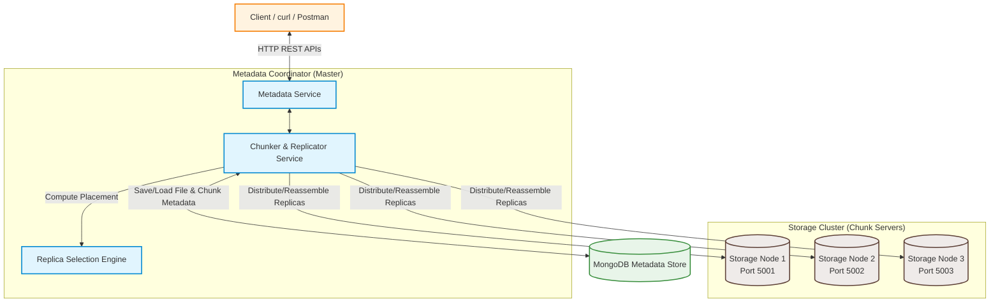

# Distributed File Storage System

A robust, fault-tolerant, and high-performance **Distributed File Storage System** built on a microservices-style architecture using **Node.js (ES Modules)**, **Express**, and **MongoDB**. 

This system partitions files into chunks, replicates them across a cluster of independent storage nodes using a Round-Robin placement strategy, verifies content integrity using SHA-256 hashes, and implements transactional rollbacks to guarantee cluster consistency during failures.

---

## 🏗️ System Architecture & Monorepo Structure

The system is designed with a coordinator-worker architecture, dividing responsibilities between a metadata manager and stateless chunk servers.

### Architectural Diagram



### High-Level Workflows

#### 📤 Upload Flow
1. **Request:** The Client uploads a file via `POST /files/upload`.
2. **Chunking:** The **Metadata Service** splits the file stream into individual buffers based on `CHUNK_SIZE` (default 4MB).
3. **Placement & Replication:** For each chunk, the **Replica Selection Engine** runs a Round-Robin placement algorithm to pick `REPLICATION_FACTOR` (default 2) storage nodes.
4. **Physical Write:** The **Replicator Service** writes the chunks concurrently to the selected **Storage Nodes** using binary stream pipelines.
5. **Metadata Registration:** Once all replicas are successfully saved, the service persists file metadata and chunk locations (including SHA-256 hashes) to **MongoDB**.
6. **Transaction Safety:** If any chunk fails to write on a node, a rollback mechanism deletes all previously uploaded chunks of this file from the storage node cluster to prevent storage leakage.

#### 📥 Download Flow
1. **Request:** The Client initiates download via `GET /files/:fileId/download`.
2. **Metadata Lookup:** The **Metadata Service** fetches file information and list of chunks sorted by index from **MongoDB**.
3. **Stream Resolution:** For each chunk, it reads the replicas array, picks the first node, and initiates a network read stream.
4. **Integrity Validation:** The downloaded chunk's SHA-256 is recalculated and verified against the metadata database.
5. **Fail-Safe Socket Termination:** If a checksum fails, the connection socket is immediately terminated (`response.destroy()`) to prevent the client from saving a corrupted file.
6. **Reassembly:** All validated chunks are streamed back sequentially to the client as a single file attachment.

---

The project is managed as a monorepo using **NPM Workspaces** and contains three primary components:


```
├── common/                  # Shared utilities and configurations
│   └── constants.js         # Centralized system constants (e.g., chunk size, max file size)
├── metadata-service/        # Metadata Service Express App
│   ├── config/              # Ports, MongoDB URIs, and node configuration
│   ├── controllers/         # REST API controller handlers
│   ├── middlewares/         # Multer configuration, error handling
│   ├── models/              # Mongoose Schemas (File, Chunk)
│   ├── routes/              # Express API route routing
│   ├── services/            # Chunker service, node service, selection logic
│   └── server.js            # Main entry point
└── storage-node/            # Physical Storage Node Express App
    ├── config/              # Port-partitioned storage directory config
    ├── controllers/         # Read/write chunk streams on local disk
    ├── routes/              # Express chunk routing
    └── server.js            # Main entry point
```

### 1. Metadata Service
Acts as the coordinator/master node. It receives client uploads, splits files into chunks (default: 4MB), determines placement nodes, and tracks metadata in MongoDB.
- **Database (MongoDB):** Uses Mongoose schemas to store `File` metadata and individual `Chunk` metadata (including replicas' node IDs and SHA-256 hashes).
- **Active Socket Termination:** If a chunk fails its integrity check during download, the socket connection is immediately destroyed to prevent the client from downloading corrupted data.
- **Transactional Rollback:** If any replica upload fails during chunk distribution, all uploaded copies of the current chunk and previous chunks for that file are deleted from the storage nodes, keeping the storage cluster clean.

### 2. Storage Nodes
Stateless, lightweight storage endpoints responsible for physically writing and reading binary data on local disk.
- **Port Partitioning:** Runs multiple instances from the same directory. The data folder is dynamically resolved as `storage-node/data/chunks/<PORT>` to keep node storage clean and isolated.
- **Binary Streaming:** Interacts with files as binary streams using Node's `pipeline` to keep RAM usage minimal even under heavy payloads.

### 3. Common
Houses shared constants such as `DEFAULT_CHUNK_SIZE` and `DEFAULT_MAX_FILE_SIZE` to prevent configuration drift between components.

---

## ⚡ Core Distributed Concepts

*   **File Chunking:** Large files are split into smaller segments (default: 4MB). Smaller chunks make transfer over network requests efficient and manageable.
*   **Round-Robin Replica Placement:** For every chunk, a set of distinct storage nodes is cyclically chosen using the formula:
    $$\text{Target Node Index} = (\text{chunkIndex} + \text{replicaOffset}) \bmod N$$
    *(where $N$ is the total storage nodes and $\text{replicaOffset} \in [0, \text{Replication Factor} - 1]$)*
*   **SHA-256 Data Integrity:** A SHA-256 hash is computed for each chunk on upload and validated on download.
*   **Fault Tolerance:** Files can survive node failures since every chunk is replicated on multiple storage nodes (defined by `REPLICATION_FACTOR`).

---

## 🚀 Getting Started

### Prerequisites
- **Node.js** (v18+ recommended)
- **MongoDB** (Running locally on default port `27017` or configured via env)

### Installation
Clone the repository and run the installation script in the root directory to install dependencies for all workspaces:
```bash
npm install
```

---

## ⚙️ Configuration (.env)

Both services run on their own configuration. Copy the example environments and adjust configurations as needed.

#### 1. Metadata Service Configuration
Create a `.env` file in the `metadata-service/` folder:
```ini
PORT=5000
MONGO_URI=mongodb://localhost:27017/distributed_storage
REPLICATION_FACTOR=2
CHUNK_SIZE=4194304
MAX_FILE_SIZE=524288000
```

#### 2. Storage Node Configuration
Create a `.env` file in the `storage-node/` folder:
```ini
PORT=5001
```

---

## 🏃 Running the System

To run a fully replication-aware cluster, you should launch the **Metadata Service** and **multiple instances of the Storage Node** on the ports defined in `metadata-service/config/storageNodes.js` (Ports `5001`, `5002`, and `5003`).

### 1. Start MongoDB
Ensure MongoDB is running locally:
```bash
mongod
```

### 2. Start the Metadata Service
```bash
npm run dev:metadata
```
*Runs on port `5000` by default.*

### 3. Start Storage Nodes
Open three terminal instances and start the storage nodes on different ports.

*   **Storage Node 1 (Port 5001):**
    ```bash
    # Windows PowerShell
    $env:PORT=5001; npm run dev:storage

    # Linux / macOS
    PORT=5001 npm run dev:storage
    ```

*   **Storage Node 2 (Port 5002):**
    ```bash
    # Windows PowerShell
    $env:PORT=5002; npm run dev:storage

    # Linux / macOS
    PORT=5002 npm run dev:storage
    ```

*   **Storage Node 3 (Port 5003):**
    ```bash
    # Windows PowerShell
    $env:PORT=5003; npm run dev:storage

    # Linux / macOS
    PORT=5003 npm run dev:storage
    ```

---

## 📡 API Reference

### Metadata Service (Port 5000)

| Endpoint | Method | Description | Payload / Query |
| :--- | :--- | :--- | :--- |
| `/files/upload` | `POST` | Upload file (multipart/form-data) | Form field name: `file` |
| `/files` | `GET` | List all files in the system | *None* |
| `/files/:fileId/download` | `GET` | Reassemble, verify, and download file | Route Param: `fileId` |
| `/files/:fileId` | `DELETE` | Delete file chunks on nodes & records from DB | Route Param: `fileId` |

### Storage Nodes (Ports 5001, 5002, 5003)

| Endpoint | Method | Description |
| :--- | :--- | :--- |
| `/health` | `GET` | Check if node is online |
| `/chunks/:chunkId` | `PUT` | Write binary chunk stream to disk |
| `/chunks/:chunkId` | `GET` | Stream chunk binary data from disk |
| `/chunks/:chunkId` | `DELETE` | Delete chunk binary file from disk |

---

## 🧪 Testing with curl

### 1. Upload a File
```bash
curl -X POST -F "file=@/path/to/your/file.txt" http://localhost:5000/files/upload
```
*Response:*
```json
{
  "success": true,
  "fileId": "d3b07384-d113-4ec2-a5d7-c93d20d880ab"
}
```

### 2. List Files
```bash
curl http://localhost:5000/files
```

### 3. Download a File
```bash
curl -o downloaded_file.txt http://localhost:5000/files/d3b07384-d113-4ec2-a5d7-c93d20d880ab/download
```

### 4. Delete a File
```bash
curl -X DELETE http://localhost:5000/files/d3b07384-d113-4ec2-a5d7-c93d20d880ab
```
