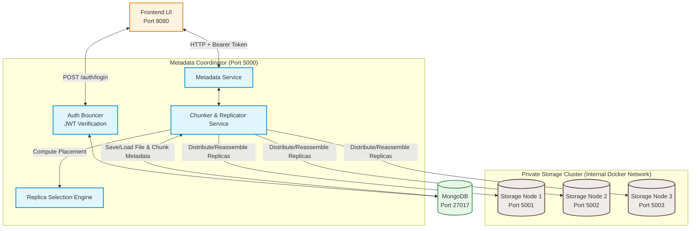

# Replicora: Distributed File Storage System

A robust, fault-tolerant, and high-performance **Distributed File Storage System** built on a microservices architecture using **Node.js**, **Express**, **MongoDB**, and **Docker**. 

Replicora acts as a secure, multi-tenant cloud drive. It partitions files into chunks, replicates them across a cluster of independent storage nodes using a Round-Robin placement strategy, verifies content integrity using SHA-256 hashes, and implements transactional rollbacks to guarantee cluster consistency during failures.

---

## ✨ Features (Phase 2)
* **Multi-Tenancy & Security:** JWT-based Authentication (`bcrypt` + `jsonwebtoken`). Users only have access to their own files.
* **Dockerized Cluster:** 6 interconnected containers spun up automatically via `docker-compose`.
* **Zero-RAM Streaming:** Uses Node.js `pipeline()` to stream files directly to storage, maintaining $O(1)$ memory complexity regardless of file size.
* **Fault Tolerance:** Configurable `REPLICATION_FACTOR` (default 2). Every chunk is backed up across multiple hard drives.
* **Frontend UI:** A clean, responsive HTML/CSS/JS frontend to register, log in, and manage your cloud drive.

---

## 🏗️ System Architecture


```mermaid
graph TD
    %% Styling
    classDef default fill:#f9f9f9,stroke:#333,stroke-width:2px;
    classDef service fill:#e1f5fe,stroke:#0288d1,stroke-width:2px;
    classDef storage fill:#efebe9,stroke:#5d4037,stroke-width:2px;
    classDef database fill:#e8f5e9,stroke:#388e3c,stroke-width:2px;
    classDef ui fill:#fff3e0,stroke:#f57c00,stroke-width:2px;

    Client[Frontend UI<br/>Port 8080]:::ui
    
    subgraph "Metadata Coordinator (Port 5000)"
        Auth[Auth Bouncer <br/> JWT Verification]:::service
        MS[Metadata Service]:::service
        Chunker[Chunker & Replicator Service]:::service
        Selector[Replica Selection Engine]:::service
    end
    
    MongoDB[(MongoDB <br/> Port 27017)]:::database
    
    subgraph "Private Storage Cluster (Internal Docker Network)"
        Node1[(Storage Node 1<br/>Port 5001)]:::storage
        Node2[(Storage Node 2<br/>Port 5002)]:::storage
        Node3[(Storage Node 3<br/>Port 5003)]:::storage
    end
    
    %% Relationships
    Client <-->|POST /auth/login| Auth
    Client <-->|HTTP + Bearer Token| MS
    Auth <--> MongoDB
    MS <--> Chunker
    Chunker -->|Compute Placement| Selector
    Chunker <-->|Save/Load File & Chunk Metadata| MongoDB
    Chunker -->|Distribute/Reassemble Replicas| Node1
    Chunker -->|Distribute/Reassemble Replicas| Node2
    Chunker -->|Distribute/Reassemble Replicas| Node3
```

---

## 📂 Project Structure

```
├── docker-compose.yml       # Master orchestrator for the 6-node cluster
├── frontend/                # Nginx web server & Vanilla JS UI
│   ├── index.html           
│   ├── style.css            
│   └── app.js               
├── common/                  # Shared utilities (Constants, hashers)
├── metadata-service/        # The Coordinator Node (Port 5000)
│   ├── controllers/         # File & Auth Controllers
│   ├── middlewares/         # JWT Auth Bouncer & Multer
│   ├── models/              # User, File, and Chunk MongoDB schemas
│   └── services/            # Chunker and replication logic
└── storage-node/            # The Worker Node Image (Reused 3x)
    └── controllers/         # Binary stream disk writers
```

---

## 🚀 Getting Started

Thanks to Docker Compose, you no longer need to manually open 5 different terminal windows to boot the cluster. 

### Prerequisites
- **Docker** and **Docker Compose** installed on your system.

### 1. Boot the Cluster
Open a terminal in the root folder and run:
```bash
docker-compose up -d --build
```
This single command will:
1. Download MongoDB.
2. Build the Storage Node image and spin it up 3 times (Node 1, Node 2, Node 3).
3. Build and launch the Metadata Service (Port 5000).
4. Build and launch the Nginx Frontend (Port 8080).
5. Map Docker Volumes so your files and databases survive computer restarts.

### 2. Access the App
Open your web browser and navigate to:
**[http://localhost:8080](http://localhost:8080)**

1. Click the **Register** tab to create an account.
2. Log in. 
3. Start uploading files! (Your files are now cryptographically locked to your account ID).

### 3. Stop the Cluster
To gracefully shut down the cluster without losing your saved files:
```bash
docker-compose down
```

---

## 🔐 API Reference (Authenticated)

All `/files` endpoints are locked down. You must pass the JWT token in the headers:
`Authorization: Bearer <your_jwt_token>`

### Auth (Public)
| Endpoint | Method | Payload |
| :--- | :--- | :--- |
| `/auth/register` | `POST` | `{"username": "...", "password": "..."}` |
| `/auth/login` | `POST` | `{"username": "...", "password": "..."}` |

### Files (Requires JWT)
| Endpoint | Method | Description |
| :--- | :--- | :--- |
| `/files/upload` | `POST` | Upload file (`multipart/form-data`). Attaches `ownerId`. |
| `/files` | `GET` | List all files owned by the currently logged-in user. |
| `/files/:fileId/download` | `GET` | Reassemble, verify SHA-256, and stream file. |
| `/files/:fileId` | `DELETE` | Delete file chunks on nodes & records from DB. |

---

## 🛡️ Security & Internal Networking
The Storage Nodes (Ports 5001, 5002, 5003) are **NOT** exposed to your host machine or the public internet. They exist entirely on a private Docker bridge network. Only the Metadata Service can talk to them. This ensures that a malicious actor cannot bypass the JWT Auth Bouncer and interact with the physical chunk disks directly. 
